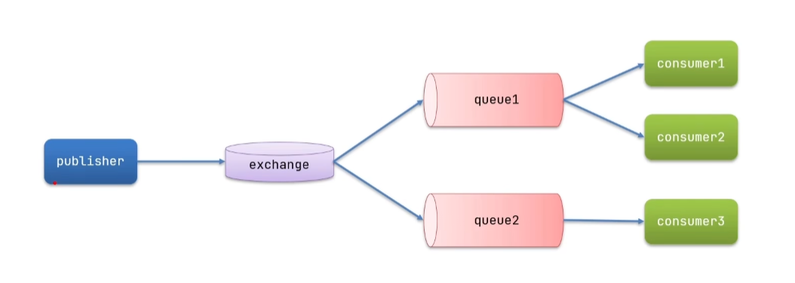
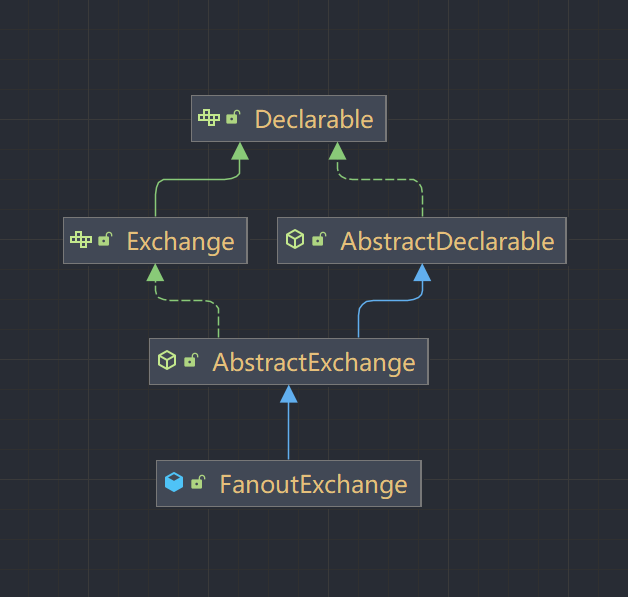
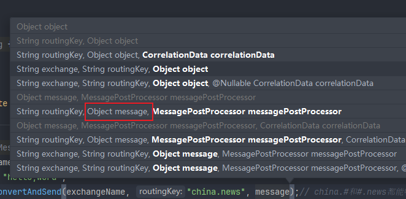

## nacos

### 快速开始

- 安装并启动`nacos`

官网：[nacos](https://nacos.io/zh-cn/index.html)

- 引入依赖

```xml
<!-- 服务注册与发现 -->
<dependency>
    <groupId>com.alibaba.cloud</groupId>
    <artifactId>spring-cloud-starter-alibaba-nacos-discovery</artifactId>
</dependency>
```

- 配置`bootstrap.yml`

```yaml
spring:
  application:
    name: consumer-server
  profiles:
    active: dev
  cloud:
    nacos:
      username: nacos
      password: nacos
      discovery:
        server-addr: 127.0.0.1:8848
        namespace: b3cda453-fe2b-4cdb-a752-1320e66c2151
        group: spring-cloud-consumer
```

- 主启动类添加`@EnableDiscoveryClient`注解(可以不配置也可以)

### 相关配置

#### 1. 负载均衡

- 引入依赖

```xml
<!-- loadbalancer -->
<dependency>
    <groupId>org.springframework.cloud</groupId>
    <artifactId>spring-cloud-loadbalancer</artifactId>
</dependency>
```

- 添加配置类

```java

@Configuration
public class BeanConfiguration {

    @Bean
    @LoadBalanced// 使用负载均衡
    public RestTemplate restTemplate() {
        return new RestTemplate();
    }

}
```

#### 2.临时实例 和 持久实例

```yaml
 # 临时实例：true(默认)  持久实例：false
 spring:
   cloud:
     nacos:
       discovery:
         ephemeral: true
```

> 临时实例 && 持久实例区别

- 临时实例

```text
临时实例则是每隔5秒上报心跳 如果15秒内未收到心跳则健康状态设置为false 超过30秒则删除实例：适合流量突增场景 服务弹性扩容
可自动注销
```

- 持久实例

```text
持久实例在服务挂掉的时候 服务还会存在 只是健康状态会变成false：运维可实时观察健康状态 便于后期扩容、警告（通过保护阈值）
```

#### 3. 保护阈值

*需要在nacos服务列表中进行设置*

保护阈值是0-1之间的浮点数，与集群中的健康实例占比相关，即当前服务健康实例数/当前服务总实例数，如果健康实例占比小于或等于设置的值，会触发保护阈值；

存在问题：如果有50个实例，其中有40个实例处于不健康状态，此时只能返回10个实例（触发了保护阈值情况下），如果请求流量较大，可能会直接击垮这10个服务实例，产生`雪崩效应`。

#### 4. 实例权重

权重取值范围在0--100之间，表示服务器的负载情况，在权重相同的情况下，
nacos默认使用`轮询算法`实现`负载均衡`，按照顺序依次轮询选择服务实例（即设置的值越大被访问的概率越大）；
在服务治理中，通过设置每个服务的权重，可以使请求更加合理，均衡的分配到每一个实例上；

*权重设置只是影响服务实例的访问概率，在高并发环境下可能会出现负载不均的情况*

- 配置权重

```yaml
# 1.在服务调用方（consumer）加入以下配置；
# 2.在nacos服务列表中设置相应的权重才能生效；
spring:
  cloud:
    loadbalancer:
      nacos:
        enabled: true
```

#### 5.命名空间 和 分组

*主要用于服务隔离*

命名空间用于区分不同的项目，默认为public；
分组用于区分某个项目中的某个服务，默认为DEFAULT_GROUP；

- 在nacos中创建按一个命名空间；
- 在模块中添加配置；

```yaml
spring:
  cloud:
    nacos:
      discovery:
        namespace: b3cda453-fe2b-4cdb-a752-1320e66c2151 # 注意：这里需要写ID
        group: spring-cloud-consumer
```

- 相同命名空间和相同组可访问；

#### 6. 集群部署

在使用nacos时，为了保证高可用，一般会进行集群部署，nacos规定在集群中节点要大于等于3个；
单机模式下数据保存下内嵌数据库中derby，不方便观察数据库存储情况；
如果集群中启用多个默认配置下的nacos节点，数据存储存在一致性问题，为了解决这个问题，
nacos采用了集中式存储方式来支持集群部署，目前只支持mysql；

**将存储更改为mysql：**

- 将nacos目录下的`conf/mysql-schema.sql`导入数据库；
- 修改nacos目录下的`conf/application.properties`文件下的如下配置：

```properties
spring.datasource.platform=mysql
spring.sql.init.platform=mysql
db.num=1
db.url.0=jdbc:mysql://127.0.0.1:3306/nacos_config?characterEncoding=utf8&connectTimeout=1000&socketTimeout=3000&autoReconnect=true&useUnicode=true&useSSL=false&serverTimezone=UTC
db.user.0=root
db.password.0=root
```

- 重新启动nacos，日志显示`use external storage`即为成功

> 集群部署

- 启用多个nacos

复制三份nacos服务，并修改每个nacos目录下的`conf/application.properties`中的port分别为8848，8858，8868；

- 在每个nacos/conf目录下的新增文件名为`cluster.conf`的文件，并添加如下配置：

*注意：如果在一个服务器上，端口间要存在距离，不能连续*

```text
192.168.8.4:8848
192.168.8.4:8858
192.168.8.4:8868
```

- 配置客户端（服务）

*server-addr设置集群即可，其余的不做改变，比如namespace*

```yaml
spring:
  cloud:
    nacos:
      discovery:
        server-addr: 127.0.0.1:8848,127.0.0.1:8858,127.0.0.1:8868
        # server-addr: 127.0.0.1:nginx地址 # 设置nginx时可以反向代理
```

- 启动

```shell
# 集群方式不需要-m standalone
# 在每个nacos/conf目录下执行
# 此时使用8848，8858，8868端口都能进入nacos
startup
```

#### 7. CAP模式

CAP是分布式系统中最基础的理论，即一个分布式系统最多只能同时满足一致性、可用性、分区容错性三项中的两种。

- 一致性

对于客户端灭磁读操作，要么督导最新数据，要么读取失败，`强调数据正确`，又可分为两种情况；
强数据一致性：每个节点数据保持完全一致；
最终数据一致性：在某个时间阈值内同步数据，最终保持一致性；

- 可用性

任何客户端都会返回响应数据，不会出现响应错误，一定会返回数据，不会返回错误，但不能保证数据最新，`强调服务不出错`；

- 分区容错性

分布式系统，网络通信不可靠，当任意消息丢失或延迟时，系统仍会提供服务，不会出现宕机，要求一直运行，`强调不宕机，不挂掉`；

*对于分布式系统而言，分区容错性是前提条件，此时只能在一致性 和 可用性中二选一*

nacos 会根据配置识别是CP模式还是AP模式，默认是AP模式；

如果注册nacos的client节点是ephemeral=true，表示为临时实力，nacos对这个client节点效果为AP；
采用distro协议实现；

如果为false，表示使用持久实例，nacos集群对这个client节点效果为CP，采用raft协议实现；

总之，服务注册中心选择AP或CP是根据业务场景决定的。如果要求数据一致性很高，且可以容忍一定时间内不可用，可以选用CP模型；
如果可以容忍一定时间延迟 不一致性 可以选用AP；

### nacos配置中心

目前主流配置中心spring cloud config、apollo（携程）、disconf（百度）、nacos（阿里）

#### 简介

**现状：**
在微服务中，配置文件比较分散，随着项目的配置文件越来越多，并且这些配置文件分散在各个微服务中，
不能进行集中管理，不好进行统一配置，对于运维和开发人员而言，管理成本较大。

无法区分环境，需要修改时就需要去各个微服务下进行手动维护。

配置文件不能实时更新，修改配置文件后需要重启微服务配置才能生效，对于一个正在运行的项目来说，是不友好的。

不支持配置内容的安全性和权限校验，如果遇到黑客攻击服务器，并获取了源码，也能直接获取配置文件并篡改；

**解决：**
nacos配置中心的本质就是将分散的配置文件通过公共组件集中在一起进行管理，Nacos控制台向开发者提供管理配置信息的功能，可以将配置管理功能与应用的运行黄静解耦；

#### 快速开始

- 引入依赖

```xml
<!-- nacos config -->
<dependency>
    <groupId>com.alibaba.cloud</groupId>
    <artifactId>spring-cloud-starter-alibaba-nacos-config</artifactId>
</dependency>
```

- 在nacos中创建对应的配置文件

- 添加配置文件`bootstrap.yml`

*使用bootstrap.yml时需要引入bootstrap依赖*

```xml
<!-- bootstrap -->
<dependency>
    <groupId>org.springframework.cloud</groupId>
    <artifactId>spring-cloud-starter-bootstrap</artifactId>
</dependency>
```

```yaml
spring:
  application:
    name: consumer-server
  profiles:
    active: dev # profile颗粒度配置 用于区分不同环境，如dev、prod、test等 配置中心命名规则：应用名-active.yml
  cloud:
    nacos:
      config:
        username: nacos
        password: nacos
        server-addr: 127.0.0.1:8848 # 配置中心地址
        namespace: b3cda453-fe2b-4cdb-a752-1320e66c2151 # 命名空间
        group: spring-cloud-consumer # 分组
        file-extension: yml
        refresh-enabled: true
#  不使用bootstrap.yml的时候需要加上这个配置（新版本配置 可以直接使用application.yml）
#  config:
#    import: optional:nacos:consumer-server-dev.yml
```

#### 配置中心和客户端数据同步模式

- push模式

客户端与服务器建立长连接，当服务器配置数据变动，立即将数据推送给客户端。
优势：可以立即推送，及时性强，使用更简单，只要建立连接接收数据，不关心数据是否变更这类逻辑的处理；
缺点：长连接可能因为网络问题，导致不可用，俗称假死状态。连接状态正常，但实际已经无法通信，使用心跳机制保证连接的可用性，才能推送成功；

- pull模式

客户端主动向服务端发送请求，拉去配置文件，常见方式轮询，比如每1s请求一次配置数据；
短轮询：不管有无变化，一直请求获取配置，缺点时对服务器造成较大压力。
长轮询：客户端发送请求，不会立即返回请求结果，请求会挂起一段时间，这段时间内服务端收据变更，立即响应客户端请求，如果一直没变更，就会等到超时时间后响应客户端请求，客户端重新发起长轮询；

nacos配置中心：使用长轮询pull模式；
nacos注册中心：push+pull模式；

#### 配置中心动态更新

*nacos无需做任何配置就可以实现动态更新配置，但是在使用`@Value`的时候 需要添加注解(后面有说明)*

- 案例

1.假设配置中心的内容为：

```yaml
server:
  port: 8888
```

2.添加启动类 此时会每隔一秒打印8888

```java

@SpringBootApplication
public class ProviderApplication {
    public static void main(String[] args) throws InterruptedException {
        ConfigurableApplicationContext context = SpringApplication.run(ProviderApplication.class, args);
        ConfigurableEnvironment environment = context.getEnvironment();
        while (true) {
            System.out.println(environment.getProperty("server.port"));
            TimeUnit.SECONDS.sleep(1);
        }
    }
}
```

3.在配置中心更改配置为：
此时无需重启服务，每隔一秒打印会变成9999

```yaml
server:
  port: 9999
```

*注意：在controller中使用`@Value`获取配置中的值，如果配置中心发生变更，不会实时刷新们需要在controller上加上`@RefreshScope`
注解才能生效*

```java

@RestController
@RequestMapping("test")
@RefreshScope // 需要加上这个注解才可以实现配置实时更新
public class TestController {
    @Value("${server.port}")
    private Integer port;

    @GetMapping("hello")
    public String test() {
        return "hello provider," + port;
    }
}
```

#### 多配置文件处理

通过配置`spring.cloud.nacos.config.shared-configs`来设置多配置文件

```yaml
spring:
  application:
    name: provider-server
  cloud:
    nacos:
      config:
        server-addr: 127.0.0.1:8848
        namespace: 8471a91d-06b0-4561-88f3-d637c72f27cc
        group: provider-server
        file-extension: yml
        refresh-enabled: true
        shared-configs:
          - data-id: aaa.yml # 共享配置文件名
            group: xxx # 分组名称
            refresh: true # 是否自动刷新

# 优先级：服务配置>extension-configs>shared-configs
#          extension-configs:
#            - data-id: aaa.yml
#              group: xxx
#              refresh: true

# 新版本配置 后加载的会覆盖先加载的（加载顺序）
#  config:
#    import:
#      - optional:nacos:consumer-server-prod.yml
#      - optional:nacos:consumer-server-dev.yml
```

### feign

#### 简介

解决服务间调用问题,使web服务客户客户端变得更加容易，具有可插拔注解支持，包括feign注解和JAX-RD注解；可插拔解码器、编码器；
只是spring mvc，只是使用spring mvc默认注解，继承eureka、loadbalancer提供负载均衡的客户端；

常见的有RestTemplate、HttpClient、OKHttp3等；

Feign继承Ribbon、RestTemplate，实现了负载均衡，不需要手动调用RestTemplate，只需要定义接口，面向接口编程，简化开发；

#### feign 和 openFeign区别

- feign

spring cloud中的轻量级RestFul客户端，不在维护；

- openFeign

基于feign，支持了spring mvc注解，并通过动态代理方式产生实现类，实现类中做负载均衡并调用其他服务，不再使用ribbon，采用loadbalancer作为负载均衡

#### 快速开始

- 引入依赖(服务消费端)

```xml
<!-- openfeign -->
<dependency>
    <groupId>org.springframework.cloud</groupId>
    <artifactId>spring-cloud-starter-openfeign</artifactId>
</dependency>
```

- 启动类添加注解开启feign客户端

```java

@SpringBootApplication
@EnableFeignClients // 允许开启feign客户端
public class ConsumerApplication {

    public static void main(String[] args) {
        SpringApplication.run(ConsumerApplication.class, args);
    }

}
```

- 服务提供方的controller

```java

@RestController
@RequestMapping("test")
public class TestController {

    @GetMapping("hello")
    public String test() {
        return "hello provider！";
    }
}
```

- 编写feign接口（服务消费端）

```java
/**
 * name/value：要调用的服务名
 * path：对应服务提供者的@RequestMapping() 可不写
 */
//@FeignClient("provider-server")
@FeignClient(value = "provider-server", path = "/test")
public interface ProviderFeign {

    @GetMapping("hello")
    String test();

}
```

- 服务消费端调用服务提供端的controller

```java

@RestController
@RequestMapping("test")
public class TestController {

    @Resource
    private ProviderFeign providerFeign;

    @GetMapping("provider")
    public String getProvider() {
        return providerFeign.test();
    }

}
```

- 超时配置

方式一：java代码

```java

@Configuration
public class BeanConfiguration {

    @Bean
    @LoadBalanced// 使用负载均衡
    public RestTemplate restTemplate(RestTemplateBuilder builder) {
        builder.setConnectTimeout(Duration.ofSeconds(2));
        builder.setReadTimeout(Duration.ofSeconds(1));
        return builder.build();
    }

}
```

方式二：yml配置

```yaml
spring:
  cloud:
    openfeign:
      client:
        config:
          default:
            connect-timeout: 2 # 连接超时（单位：秒）
            read-timeout: 1 # 读取超时（单位：秒）
```

#### 日志配置

*注意：只响应debug模式*

NONE：（适合上线）不记录任何日志，默认是这个
BASIC：记录请求方法、URL地址、响应状态码和执行时间
HEADERS：包含BASIC的记录，并记录请求响应的headers
FULL：（适合开发测试）记录请求和响应的header、body和元数据

方式一：java代码

```java

@Configuration
public class OpenFeignConfig {
    @Bean
    Logger.Level level() {
//        return Logger.Level.NONE;
//        return Logger.Level.BASIC;
//        return Logger.Level.HEADERS;
        return Logger.Level.FULL;
    }
}

```

*springboot默认的日志级别为INFO，需要更改才能实现日志打印*

```yaml
logging:
  level:
    com.hetongxue.cloud.feign: debug # 这里是你的feign的包路径
```

方式二：yml配置

```yaml
spring:
  cloud:
    openfeign:
      client:
        config:
          default:
            logger-level: full
```

*如果同时设置的话。yml的优先级高于java代码*

### RabbitMQ

#### 快速入门

- 引入依赖

```xml

<dependency>
    <groupId>org.springframework.boot</groupId>
    <artifactId>spring-boot-starter-amqp</artifactId>
    <version>3.1.5</version>
</dependency>
```

- 添加配置

*注意：消息接收者 和 消息发送者都需要添加这个配置*

```yaml
spring:
  rabbitmq:
    host: 127.0.0.1 # 你的rabbitmq地址
    port: 5672 # 端口地址
    username: rabbitmq # 你的用户名
    password: rabbitmq # 你的密码
    virtual-host: / # 虚拟地址

```

> 简单使用

- 服务提供者 - 发送消息

通过使用`RabbitTemplate`发送消息，第一个参数是队列名字，第二个参数是消息内容（可以是对象、文本、列表等）

```java
public class TestController {

    @Resource
    private RabbitTemplate rabbitTemplate;

    public void testSendMessage() {
        String queueName = "queue.name";
        String message = "hello,amqp";
        rabbitTemplate.convertAndSend(queueName, message);
    }

}
```

- 服务消费者 - 接收消息

通过`@RabbitListener`注解，其中的`queues`是监听的队列名称，接收对应的消息`message`（这里message的类型与发送的一致）

*注意：该类需要添加`@Component`交给spring管理*

```java

@Component
public class TestListener {
    @RabbitListener(queues = "queue.name")
    public void listenSimpleQueueMessage(String message) {
        System.out.println("message = " + message);
    }
}
```

> WorkQueue使用

WorkQueue（即工作队列），解决在消息发送量大于单个消息接收者的处理量时，达到多个消息接收者共同处理的效果，提高消息处理速度，避免消息队列堆积最终导致消息丢失

- 添加配置

说明：通过设置prefetch值，来控制消费者获取消息阈值；

```yaml
spring:
  rabbitmq:
    listener:
      simple:
        prefetch: 1 # 每次只获取一条消息 处理完成后在获取下一条消息
```

- 服务提供者 - 假设1秒钟发送100条消息

```java
public class TestController {

    @Resource
    private RabbitTemplate rabbitTemplate;

    public void testSendMessage() throws InterruptedException {
        String queueName = "queue.name";
        String message = "hello,amqp";
        for (int i = 0; i < 100; i++) {
            rabbitTemplate.convertAndSend(queueName, message + i);
            Thread.sleep(10);
        }
    }

}
```

- 服务消费者 - 多个消费者

```java

@Component
public class TestListener {

    @RabbitListener(queues = "queue.name")// 模拟消费者1
    public void listenSimpleQueueMessage1(String message) throws InterruptedException {
        System.out.println("message = " + message);
        Thread.sleep(5);
    }

    @RabbitListener(queues = "queue.name")// 模拟消费者2
    public void listenSimpleQueueMessage2(String message) throws InterruptedException {
        System.out.println("message = " + message);
        Thread.sleep(10);
    }

}
```

> 发布 && 订阅

之前的使用方法都是发出的消息只能被一个消费者消费，一旦消费后就会在队列中删除，这个特征无法满足被多个消费者消费，例如用户支付成功后通知订单服务、仓储服务、短信服务；
此时需要被三个服务都收到并消费，这就需要用到发布 && 订阅；

发布订阅，需要经过`exchange`（交换机），最终消息发送给哪个消费者，由交换机决定，交换机常见类型有：

- Fanout：广播
- Direct：路由
- Topic：话题

*注意：exchange负责消息路由，并不是存储，路由失败也会导致消息丢失*



1. Fanout-Change

**该模式会将接收到的所有消息都路由到每一个`绑定`的queue上**



- 交换机与队列绑定

```java

@Configuration
public class FanoutConfig {

    // 声明一个FanoutExchange交换机
    @Bean
    public FanoutExchange fanoutExchange() {
        return new FanoutExchange("fanout.exchange");
    }


    // 声明第一个队列：fanout.queue1
    @Bean
    public Queue fanoutQueue1() {
        return new Queue("fanout.queue1");
    }

    // 绑定 队列fanout.queue1 与 交换机fanout.exchange
    @Bean
    public Binding bindingQueue1(Queue fanoutQueue1, FanoutExchange fanoutExchange) {
        return BindingBuilder.bind(fanoutQueue1).to(fanoutExchange);
    }


    // 声明第二个队列：fanout.queue2
    @Bean
    public Queue fanoutQueue2() {
        return new Queue("fanout.queue2");
    }

    // 绑定 队列fanout.queue2 与 交换机fanout.exchange
    @Bean
    public Binding bindingQueue1(Queue fanoutQueue2, FanoutExchange fanoutExchange) {
        return BindingBuilder.bind(fanoutQueue2).to(fanoutExchange);
    }

    // ...后面的多个绑定方法同上
}
```

- 服务提供者 - 发送消息

```java
public class TestController {

    @Resource
    private RabbitTemplate rabbitTemplate;

    public void testSendMessage() {
        String exchangeName = "fanout.exchange";
        String message = "hello,fanout exchange";
        rabbitTemplate.convertAndSend(exchangeName, "", message);
    }

}
```

- 服务消费者 - 接收消息（多个服务接收）

```java

@Component
public class TestListener {

    @RabbitListener(queues = "fanout.queue1")
    public void listenSimpleQueueMessage1(String message) {
        System.out.println("message = " + message);
    }

    @RabbitListener(queues = "fanout.queue2")
    public void listenSimpleQueueMessage2(String message) {
        System.out.println("message = " + message);
    }

}
```

问题：
1.交换机作用？

- 接收订阅发送的消息；
- 将消息按规则路由到绑定的队列中去；
- `不能缓存消息`，路由失败消息会丢失；

2. Direct-Change

**该模式会将接收到的消息都路由到`指定`的queue，又叫路由模式**

每一个queue都和exchange有一个`BindingKey`，服务提供者发布消息的时候，指定消息的`RoutingKey`
，如果两个queue存在相同的`RoutingKey`，实现与Fanout一致

- 服务提供者 - 发送消息（指定key）

```java
public class TestController {

    @Resource
    private RabbitTemplate rabbitTemplate;

    public void testSendMessage() {
        String exchangeName = "direct.exchange";
        String message = "hello,type1";
        rabbitTemplate.convertAndSend(exchangeName, "type1", message);// 此时只有绑定type1的队列才可以收到
    }

}
```

- 服务消费者 - 接收消息（设置RoutingKey）

```java

@Component
public class TestListener {

    /**
     * value：队列信息
     * exchange：交换机信息
     * key：key列表
     */
    @RabbitListener(bindings = @QueueBinding(
            value = @Queue(name = "direct.queue1"),
            exchange = @Exchange(name = "direct.exchange", type = ExchangeTypes.DIRECT),
            key = {"type1", "type2"}))
    public void listenSimpleQueueMessage1(String message) {
        System.out.println("message = " + message);
    }


    @RabbitListener(bindings = @QueueBinding(
            value = @Queue(name = "direct.queue2"),
            exchange = @Exchange(name = "direct.exchange", type = ExchangeTypes.DIRECT),
            key = {"type1", "type3"}))
    public void listenSimpleQueueMessage2(String message) {
        System.out.println("message = " + message);
    }

}
```

3. Topic-Change

**与Direct类似，区别在于RoutingKey必须由多个单词组成，并且以`,`分割，故叫话题模式，例如我要查看重庆的天气和上海的天气，
只需要设置重庆和上海的单词key**

通配符
#：指代0或多个单词
*：指代一个单词

例如：china.# 或 #.news

- 服务提供者 - 发送消息（指定type为topic）

```java
public class TestController {

    @Resource
    private RabbitTemplate rabbitTemplate;

    public void testSendMessage() {
        String exchangeName = "direct.exchange";
        String message = "hello,word";
        rabbitTemplate.convertAndSend(exchangeName, "china.news", message);// china.#和#.news都能收到
        rabbitTemplate.convertAndSend(exchangeName, "china.car", message);// 只有绑定china.#的能收到
    }

}
```

- 服务消费者 - 接收消息

```java

@Component
public class TestListener {

    // 这里的type要设置为TOPIC
    @RabbitListener(bindings = @QueueBinding(
            value = @Queue(name = "direct.queue1"),
            exchange = @Exchange(name = "topic.exchange", type = ExchangeTypes.TOPIC),
            key = {"china.#"}))
    public void listenSimpleQueueMessage1(String message) {
        System.out.println("message = " + message);
    }


    @RabbitListener(bindings = @QueueBinding(
            value = @Queue(name = "topic.queue2"),
            exchange = @Exchange(name = "topic.exchange", type = ExchangeTypes.TOPIC),
            key = {"#.news"}))
    public void listenSimpleQueueMessage2(String message) {
        System.out.println("message = " + message);
    }

}
```

> 消息转换器

作用：在发送消息中，接收消息的类型是Object，MQ默认会自动序列化数据（默认使用org.springframework.amqp.support.converter.MessageConverter处理），最好自己设置序列化；

序列化与反序列化



- 引入依赖（不一定非要用这个）

```xml

<dependency>
    <groupId>com.fasterxml.jackson.core</groupId>
    <artifactId>jackson-databind</artifactId>
</dependency>
```

- 添加配置类

```java

@Configuration
public class MessageConverterConfig {

    @Bean
    public MessageConverter messageConverter() {
        return new Jackson2JsonMessageConverter();
    }

}
```

```java
public class TestController {

    @Resource
    private RabbitTemplate rabbitTemplate;

    public void testSendMessage() {
        String exchangeName = "direct.exchange";
        Map<String, Object> message = new HashMap<>();
        message.put("1", "test1");
        message.put("2", "test2");
        message.put("3", "test3");
        rabbitTemplate.convertAndSend(exchangeName, "china.car", message);
    }

}
```

```java

@Component
public class TestListener {

    @RabbitListener(queues = "direct.queue1")
    public void listenSimpleQueueMessage1(Map<String, Object> message) {
        System.out.println("message = " + message);
    }

}
```